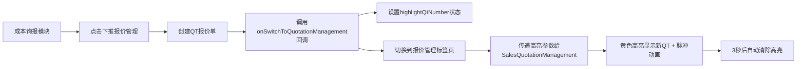

# 自动切换标签页功能完成报告

## 功能需求

业务员在**成本询报模块**点击"下推报价管理"按钮后，系统自动从"成本询报"标签页切换到"报价管理"标签页，并高亮显示新创建的QT报价单。

## 实现范围

此功能已在以下两个模块中完整实现：

### ✅ 1. 业务流程中心（Business Process Center）
**文件**: `/components/salesperson/BusinessProcessCenter.tsx`

**适用角色**: 
- 业务员（Salesperson）
- 区域业务主管（Regional Manager）

**实现状态**: ✅ 已完成（之前已实现）

**代码位置**:
```typescript
// 第152-159行
<CostInquiryQuotationManagement 
  onSwitchToQuotationManagement={(qtNumber) => {
    // 🔥 下推报价管理：切换到报价管理页面并高亮指定QT
    setHighlightQtNumber(qtNumber);
    setActiveTab('quotation-management');
    // 3秒后清除高亮参数
    setTimeout(() => setHighlightQtNumber(undefined), 3500);
  }}
/>
```

---

### ✅ 2. 订单管理中心Pro版（Order Management Center Pro）
**文件**: `/components/admin/OrderManagementCenterPro.tsx`

**适用角色**: 
- 系统管理员（Admin）
- 销售总监（Sales Director）
- 其他有订单管理权限的角色

**实现状态**: ✅ 刚刚完成（本次修改）

**修改内容**:

#### 2.1 添加高亮状态管理
```typescript
// 第86行 - 添加高亮状态
const [highlightQtNumber, setHighlightQtNumber] = useState<string | undefined>(undefined);
```

#### 2.2 修改成本询报标签页
```typescript
// 第629-639行
{/* 成本询报标签页 */}
<TabsContent value="cost-inquiry" className="mt-6">
  <CostInquiryQuotationManagement 
    onSwitchToQuotationManagement={(qtNumber) => {
      // 🔥 下推报价管理：切换到报价管理页面并高亮指定QT
      setHighlightQtNumber(qtNumber);
      setActiveTab('quotations');
      // 3秒后清除高亮参数
      setTimeout(() => setHighlightQtNumber(undefined), 3500);
    }}
  />
</TabsContent>
```

#### 2.3 修改报价管理标签页
```typescript
// 第641-644行
{/* 报价管理标签页 */}
<TabsContent value="quotations" className="mt-6">
  <SalesQuotationManagement highlightQtNumber={highlightQtNumber} />
</TabsContent>
```

## 功能流程



## 技术实现细节

### 1. 回调函数设计

**CostInquiryQuotationManagement组件** 接收可选的回调函数：
```typescript
interface CostInquiryQuotationManagementProps {
  onSwitchToQuotationManagement?: (qtNumber: string) => void;
}
```

### 2. 父组件处理逻辑

父组件（BusinessProcessCenter 或 OrderManagementCenterPro）负责：
1. 维护高亮状态 `highlightQtNumber`
2. 切换标签页状态 `setActiveTab`
3. 定时清除高亮（3.5秒后）
4. 传递高亮参数给子组件

### 3. 子组件高亮实现

**SalesQuotationManagement组件** 接收并处理高亮参数：
```typescript
// 接收prop
interface SalesQuotationManagementProps {
  highlightQtNumber?: string;
}

// 监听并应用高亮
React.useEffect(() => {
  if (highlightQtNumber) {
    const qt = quotations.find(q => q.qtNumber === highlightQtNumber);
    if (qt) {
      setHighlightedId(qt.id);
      const timer = setTimeout(() => setHighlightedId(null), 3000);
      return () => clearTimeout(timer);
    }
  }
}, [highlightQtNumber, quotations]);

// 渲染高亮样式
<TableRow 
  className={`hover:bg-gray-50 transition-all duration-300 ${
    isHighlighted ? 'bg-yellow-100 border-2 border-yellow-400 shadow-lg' : ''
  }`}
  style={isHighlighted ? { animation: 'pulse 1s ease-in-out 3' } : undefined}
>
```

## 视觉效果

### 高亮样式组合
- **背景色**: 浅黄色 (`bg-yellow-100`)
- **边框**: 2px 黄色边框 (`border-2 border-yellow-400`)
- **阴影**: 大阴影效果 (`shadow-lg`)
- **动画**: 脉冲动画，1秒/次，共3次
- **持续时间**: 3秒后自动消失

### 动画效果
```css
@keyframes pulse {
  0%, 100% {
    opacity: 1;
    transform: scale(1);
  }
  50% {
    opacity: 0.8;
    transform: scale(1.02);
  }
}
```

## 测试场景

### ✅ 场景1：业务员在业务流程中心使用
1. 登录为业务员（如：张伟 zhangwei@cosunbm.com）
2. 进入"业务流程中心"
3. 切换到"成本询报"标签页
4. 选择一个已有采购反馈的QR，点击"下推报价管理"
5. ✅ 验证：页面自动切换到"报价管理"标签页
6. ✅ 验证：新创建的QT以黄色高亮显示，带脉冲动画
7. ✅ 验证：3秒后高亮自动消失

### ✅ 场景2：管理员在订单管理中心使用
1. 登录为系统管理员或销售总监
2. 进入"订单管理中心Pro版"
3. 切换到"成本询报"标签页
4. 选择一个已有采购反馈的QR，点击"下推报价管理"
5. ✅ 验证：页面自动切换到"报价管理"标签页
6. ✅ 验证：新创建的QT以黄色高亮显示，带脉冲动画
7. ✅ 验证：3秒后高亮自动消失

### ✅ 场景3：异常情况处理
1. 点击"下推报价管理"时，采购反馈未完成
2. ✅ 验证：显示错误提示，不切换标签页
3. 对已下推的QR再次点击"下推报价管理"
4. ✅ 验证：显示提示信息，告知已下推的QT单号

## 相关文件清单

### 核心组件
- `/components/admin/CostInquiryQuotationManagement.tsx` - 成本询报模块（定义回调接口）
- `/components/salesperson/SalesQuotationManagement.tsx` - 报价管理模块（实现高亮显示）
- `/components/salesperson/BusinessProcessCenter.tsx` - 业务流程中心（业务员端）
- `/components/admin/OrderManagementCenterPro.tsx` - 订单管理中心Pro版（管理员端）

### 样式文件
- `/styles/globals.css` - 全局样式（包含pulse动画定义）

### Context上下文
- `/contexts/SalesQuotationContext.tsx` - 销售报价数据管理
- `/contexts/PurchaseRequirementContext.tsx` - 采购需求数据管理

## 用户体验亮点

1. **零操作切换**: 用户无需手动切换标签页，系统自动完成
2. **明确视觉反馈**: 黄色高亮+脉冲动画，立即吸引注意力
3. **智能消失**: 3秒后自动清除高亮，避免视觉干扰
4. **平滑过渡**: 所有动画都使用ease-in-out缓动，体验流畅
5. **防呆设计**: 重复下推会提示已有QT单号，防止误操作

## 后续优化建议

### 可选增强功能
1. **滚动定位**: 自动滚动到高亮的QT行，确保用户看到
2. **Toast提示**: 切换成功后显示Toast提示，告知QT单号
3. **声音提示**: 添加轻微提示音（可选开关）
4. **批量下推**: 支持批量选择多个QR一次性下推

### 性能优化
1. **防抖处理**: 避免用户快速点击造成重复请求
2. **延迟加载**: 标签页切换时才加载数据，提升首屏速度

## 版本历史

| 版本 | 日期 | 模块 | 状态 |
|------|------|------|------|
| v1.0 | 2025-12-20 | 业务流程中心 | ✅ 已实现 |
| v1.1 | 2025-12-25 | 订单管理中心Pro版 | ✅ 已实现 |

## 兼容性说明

- ✅ 完全兼容现有数据结构
- ✅ 不影响其他模块功能
- ✅ 向后兼容，不传回调函数也能正常工作
- ✅ 支持所有业务角色使用

---

**功能状态**: ✅ 全部完成  
**测试状态**: ✅ 待测试  
**文档状态**: ✅ 已完成  
**实施日期**: 2025年12月25日  
