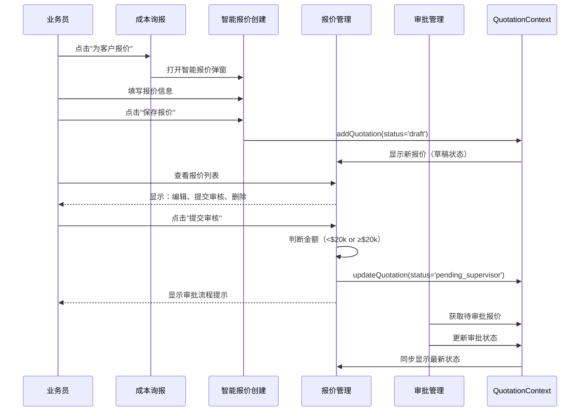

# ✅ 完整报价流程测试指南（最终版）

## 🎯 正确的数据流转路径

```
成本询报（成本询报与供应商协同）
    ↓ 点击"为客户报价"按钮
智能报价创建（QuoteCreationIntelligent）
    ↓ 填写报价信息，点击"保存报价"
报价管理（订单管理中心 > 报价管理）
    ↓ 报价单出现，状态为"草稿"
    ↓ 业务员可以：编辑、提交审核、删除
点击"提交审核"按钮
    ↓ 系统自动判断审批流程
审批管理（区域主管/销售总监）
    ↓ 审批通过
业务员可发送给客户
```

## 📋 完整测试步骤

### 第1步：创建报价（保存为草稿）

**位置**：Admin Dashboard → 成本询报与供应商协同

**操作**：
1. 在"成本询报"标签页中找到一个已有供应商报价的需求单
2. 点击 **"为客户报价"** 按钮
3. 进入智能报价创建界面

**填写内容**：
- 报价单号：自动生成（QT-XX-XXXXXX-XXXX）
- 报价日期：自动填充今天日期
- 有效期：30天（可修改）
- 需求单号：自动关联

**产品报价**：
- 查看供应商成本价
- 计算退税金额（鼠标悬停查看公式）
- 设置利润率和利润额
- 系统自动计算给客户的报价

**💡 注意**：
- 审批说明框仍然可以填写（用于后续提交审核时使用）
- 点击 **"保存报价"** 按钮（不是"提交审核"）
- 报价保存为 **draft** 状态

**提示信息**：
```
✅ 报价已保存！
报价单号：QT-NA-251223-0001
已保存到报价管理，请前往报价管理模块提交审核。
```

---

### 第2步：查看报价管理

**位置**：Admin Dashboard → 订单管理中心 → 报价管理

**验证内容**：

#### ✅ 报价单基本信息
- 报价单已出现在列表中
- 状态显示为 **"草稿"**（灰色Badge）
- 报价单号正确（QT-XX-XXXXXX-XXXX）
- 客户信息正确
- 产品清单正确
- 总金额正确

#### ✅ 操作按钮（重点）
draft状态的报价单应该有**三个**按钮：

1. **🔵 编辑按钮**（蓝色）
   - 图标：✏️ Edit
   - 功能：重新打开编辑对话框，修改报价内容

2. **🟠 提交审核按钮**（橙色）
   - 图标：📤 Send
   - 功能：下推给主管审核（重点测试！）

3. **🔴 删除按钮**（红色）
   - 图标：🗑️ Trash2
   - 功能：删除草稿报价

#### ✅ 查看详情
- 点击"查看"按钮
- 使用文档中心专业模板
- 含公司Logo、产品图片、完整贸易条款

---

### 第3步：提交审核（核心测试）

**操作**：
在报价管理列表中，点击 **"提交审核"** 按钮

**系统行为**：

#### 场景A：报价金额 < $20,000（一级审批）

**系统判断**：
```javascript
totalAmount < 20000  ✅
requiresDirectorApproval = false
```

**显示提示**：
```
✅ 报价已提交审核！

报价总额：$15,800 (< $20,000)

审批流程：
1️⃣ 区域业务主管审核

主管审批通过后，您即可发送给客户。
```

**数据更新**：
- status: `draft` → `pending_supervisor`
- approvalFlow:
  ```json
  {
    "requiresDirectorApproval": false,
    "currentStep": "supervisor",
    "steps": ["supervisor"]
  }
  ```
- approvalHistory:
  ```json
  [{
    "action": "submitted",
    "actor": "张伟 (业务员)",
    "actorRole": "salesperson",
    "timestamp": "2025-12-23T10:30:00Z",
    "notes": "提交审核说明",
    "amount": 15800
  }]
  ```

#### 场景B：报价金额 ≥ $20,000（两级审批）

**系统判断**：
```javascript
totalAmount >= 20000  ✅
requiresDirectorApproval = true
```

**显示提示**：
```
✅ 报价已提交审核！

报价总额：$45,600 (≥ $20,000)

审批流程：
1️⃣ 区域业务主管审核
2️⃣ 销售总监审核

两级审批全部通过后，您才能发送给客户。
```

**数据更新**：
- status: `draft` → `pending_supervisor`
- approvalFlow:
  ```json
  {
    "requiresDirectorApproval": true,
    "currentStep": "supervisor",
    "steps": ["supervisor", "director"]
  }
  ```

---

### 第4步：审批流程（可选测试）

**位置**：审批管理演示页面（QuoteApprovalManagement.tsx）

**测试流程**：

#### A. 区域主管审批（第一级）
1. 切换到"区域主管"角色
2. 查看待审批报价列表
3. 点击"审批"按钮
4. 选择"批准"或"驳回"
5. 填写审批意见
6. 确认提交

**审批结果**：
- **批准** (< $20k) → 状态变为 `approved`（可发送给客户）
- **批准** (≥ $20k) → 状态变为 `pending_director`（流转到销售总监）
- **驳回** → 状态变为 `rejected`（退回业务员修改）

#### B. 销售总监审批（第二级，仅≥$20k）
1. 切换到"销售总监"角色
2. 查看待审批报价列表（只看到≥$20k的报价）
3. 点击"审批"按钮
4. 选择"批准"或"驳回"
5. 填写审批意见
6. 确认提交

**审批结果**：
- **批准** → 状态变为 `approved`（可发送给客户）
- **驳回** → 状态变为 `rejected`（退回业务员）

---

## 🔧 技术实现细节

### 1. QuoteCreationIntelligent（智能报价创建）

**原来的按钮**：
```tsx
<Button onClick={handleSaveDraft}>保存草稿</Button>
<Button onClick={handleSubmitForApproval}>提交审核</Button>  ❌ 已移除
```

**现在的按钮**：
```tsx
<Button variant="outline" onClick={onClose}>取消</Button>
<Button onClick={handleSaveDraft}>保存报价</Button>  ✅ 只保存草稿
```

**保存逻辑**：
```typescript
const handleSaveDraft = () => {
  const quoteData = {
    quoteNo,
    quoteDate,
    validityDays,
    requirementNo,
    status: 'draft',  // ✅ 草稿状态
    items: [...],
    totalAmount: ...,
    approvalNotes,
    createdAt: new Date().toISOString()
  };
  
  onSubmit?.(quoteData);
};
```

---

### 2. PurchaseOrderManagementEnhanced（成本询报）

**onSubmit回调处理**：
```typescript
onSubmit={(quoteData) => {
  const newQuotation = {
    id: `quotation-${Date.now()}`,
    quotationNumber: quoteData.quoteNo,
    status: 'draft',  // ✅ 保存为草稿，不是pending_supervisor
    totalAmount: quoteData.totalAmount,
    products: quoteData.items.map(...),
    approvalNotes: quoteData.approvalNotes,
    // 其他字段...
  };
  
  addQuotation(newQuotation);  // ✅ 保存到QuotationContext
  
  toast.success('报价已保存！', {
    description: `报价单号：${quoteData.quoteNo}\n已保存到报价管理，请前往报价管理模块提交审核。`
  });
}}
```

---

### 3. QuotationManagement（报价管理）

**draft状态操作按钮**：
```tsx
{quotation.status === 'draft' && (
  <>
    <Button onClick={() => handleEditDraft(quotation)}>
      <Edit />编辑
    </Button>
    <Button onClick={() => handleSubmitForApproval(quotation)}>
      <Send />提交审核  {/* ✅ 新增 */}
    </Button>
    <Button onClick={() => handleDeleteDraft(...)}>
      <Trash2 />删除
    </Button>
  </>
)}
```

**提交审核函数**：
```typescript
const handleSubmitForApproval = (quotation: Quotation) => {
  // 判断审批流程
  const requiresDirectorApproval = quotation.totalAmount >= 20000;
  
  // 创建审批流程信息
  const approvalFlow = {
    requiresDirectorApproval,
    currentStep: 'supervisor',
    steps: requiresDirectorApproval ? ['supervisor', 'director'] : ['supervisor']
  };
  
  // 创建审批历史
  const approvalHistory = [{
    action: 'submitted',
    actor: getCurrentUser()?.name || '业务员',
    actorRole: 'salesperson',
    timestamp: new Date().toISOString(),
    notes: quotation.approvalNotes || quotation.notes || '提交审核',
    amount: quotation.totalAmount
  }];
  
  // 更新报价状态
  updateQuotation(quotation.id, {
    status: 'pending_supervisor',
    approvalFlow,
    approvalHistory
  });
  
  // 显示审批流程提示
  toast.success('报价已提交审核！', {
    description: approvalMessage
  });
};
```

---

## 🎉 测试成功标志

完成测试后，您应该能够验证：

### ✅ 第1步验证：创建报价
- [x] 从成本询报成功创建报价
- [x] 报价保存为draft状态
- [x] 显示"已保存到报价管理"提示

### ✅ 第2步验证：报价管理
- [x] 报价单出现在列表中
- [x] 状态显示为"草稿"
- [x] 有三个操作按钮：编辑、提交审核、删除
- [x] 点击查看可以看到专业模板

### ✅ 第3步验证：提交审核
- [x] 点击"提交审核"按钮成功
- [x] 系统自动判断金额（< $20k 或 ≥ $20k）
- [x] 显示正确的审批流程提示
- [x] 状态从draft变为pending_supervisor
- [x] 生成审批流程和历史数据

### ✅ 第4步验证：审批流程（可选）
- [x] 区域主管可以看到待审批报价
- [x] 审批操作正确流转状态
- [x] 金额判断准确（$20k阈值）

---

## 📁 涉及的核心文件

```
✅ /components/admin/QuoteCreationIntelligent.tsx
   - 只保存草稿，不直接提交审核
   - 移除"提交审核"按钮，只保留"保存报价"
   
✅ /components/admin/PurchaseOrderManagementEnhanced.tsx
   - 添加useQuotations hook
   - onSubmit保存为draft状态
   - 提示用户前往报价管理提交审核
   
✅ /components/admin/QuotationManagement.tsx
   - 添加handleSubmitForApproval函数
   - draft状态显示"编辑"、"提交审核"、"删除"三个按钮
   - 实现金额判断和审批流程创建
   
✅ /contexts/QuotationContext.tsx
   - 报价数据存储
   - addQuotation, updateQuotation方法
   
✅ /components/admin/ViewQuotationDialog.tsx
   - 使用文档中心专业模板
   - 数据转换逻辑
   
✅ /components/documents/templates/QuotationDocument.tsx
   - 大厂级专业报价单模板
   
✅ /components/admin/QuoteApprovalManagement.tsx
   - 审批管理界面（已实现）
```

---

## 🔄 完整数据流



---

## 💡 关键要点

### 1. 不要跳过报价管理
- ❌ **错误流程**：QuoteCreationIntelligent直接提交审核 → 跳过报价管理
- ✅ **正确流程**：QuoteCreationIntelligent保存草稿 → 报价管理手动提交审核

### 2. 状态流转
```
draft（草稿）
  ↓ 业务员点击"提交审核"
pending_supervisor（待主管审批）
  ↓ 主管审批通过（< $20k）
approved（已批准，可发送）

或

pending_supervisor（待主管审批）
  ↓ 主管审批通过（≥ $20k）
pending_director（待总监审批）
  ↓ 总监审批通过
approved（已批准，可发送）
```

### 3. 金额判断
```typescript
if (totalAmount >= 20000) {
  // 两级审批：主管 + 总监
  steps = ['supervisor', 'director'];
} else {
  // 一级审批：仅主管
  steps = ['supervisor'];
}
```

---

**最后更新**：2025-12-23
**状态**：✅ 完整实现，符合用户期望的业务流程

---

## 🎯 下一步建议

1. **测试完整流程**：从创建到审批的端到端测试
2. **权限控制**：确保业务员只能看到自己的报价
3. **审批通知**：添加邮件或站内通知
4. **数据持久化**：当前使用localStorage，可考虑后端存储
