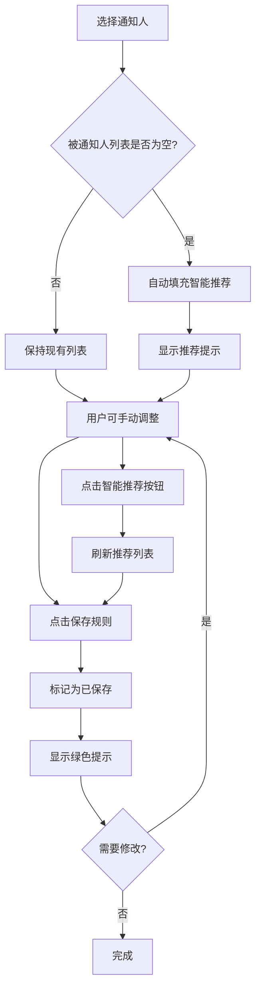

# 🌐 智能通知规则系统 - 完整说明

## 🎯 功能概述

实现了基于区域的智能通知规则系统，能够根据通知人的区域自动推荐对应的被通知人，并支持保存和修改通知规则。

---

## ✨ 核心功能

### 1. 区域智能匹配

系统会根据通知人的区域自动推荐被通知人：

#### 📋 匹配规则

**规则1：客户发送通知**
- **北美区客户** → 自动推荐：
  - 张伟 (北美区业务员)
  - 李娜 (北美区业务员)
  - 王主管 (北美区业务主管)
  - 赵总 (销售总监)

- **南美区客户** → 自动推荐：
  - 刘强 (南美区业务员)
  - 陈红 (南美区业务员)
  - 周主管 (南美区业务主管)
  - 赵总 (销售总监)

- **欧非区客户** → 自动推荐：
  - 杨明 (欧非区业务员)
  - 吴芳 (欧非区业务员)
  - 郑主管 (欧非区业务主管)
  - 赵总 (销售总监)

**规则2：业务员发送通知**
- **任何区域业务员** → 自动推荐：
  - 同区域业务主管
  - 销售总监

**规则3：业务主管发送通知**
- **任何区域业务主管** → 自动推荐：
  - 销售总监
  - 同区域所有业务员

**规则4：采购员发送通知**
- **采购员** → 自动推荐：
  - 供应商

### 2. 智能推荐触发

系统提供两种触发方式：

#### A. 自动触发
选择通知人后，如果被通知人列表为空，系统自动填充推荐人员。

```typescript
// 选择北美区客户 Maria Garcia
通知人: Maria Garcia (北美区客户)
被通知人: 自动填充 → [
  "张伟 (北美区业务员)",
  "李娜 (北美区业务员)", 
  "王主管 (北美区业务主管)",
  "赵总 (销售总监)"
]
```

#### B. 手动触发
点击"智能推荐"按钮，强制刷新推荐列表。

### 3. 保存通知规则

#### 保存流程

1. **选择通知人**
   - 从下拉列表选择通知发送者
   - 系统自动推荐被通知人（如果列表为空）

2. **确认/修改被通知人**
   - 查看自动推荐的人员
   - 可添加或删除被通知人
   - 可点击"智能推荐"重新获取推荐

3. **保存规则**
   - 点击"保存规则"按钮
   - 系统标记为已保存状态
   - 显示绿色✓已保存提示

4. **后续修改**
   - 已保存的规则仍可随时修改
   - 修改后需要重新点击"保存规则"

#### 保存状态指示

| 状态 | 按钮样式 | 说明 |
|-----|---------|------|
| 未保存 | 橙色背景 "保存规则" | 当前规则未保存 |
| 已保存 | 绿色边框 "✓ 已保存" | 当前规则已保存 |
| 推荐未保存 | 橙色按钮 + 黄色提示 | 使用了智能推荐但未保存 |

---

## 🎨 用户界面

### 通知信息编辑器布局

```
┌─────────────────────────────────────┐
│ 🔔 通知信息                          │
├─────────────────────────────────────┤
│ 通知人                               │
│ [Maria Garcia (北美区客户) ▼]       │
│                                     │
│ 被通知人                             │
│ [添加被通知人 ▼]                    │
│ [张伟...] [李娜...] [王主管...] [X] │
│                                     │
│ 通知内容                             │
│ ┌──────────────────────────────┐   │
│ │ Inquiry notification sent   │   │
│ │ to 3 recipients              │   │
│ └──────────────────────────────┘   │
│                                     │
│ [智能推荐] [保存规则]                │
│                                     │
│ ⚠️ 已根据区域自动推荐被通知人        │
│    点击"保存规则"确认               │
└─────────────────────────────────────┘
```

### 状态提示

#### 智能推荐提示（黄色）
```
⚠️ 已根据区域自动推荐被通知人，点击"保存规则"确认。
```

#### 已保存提示（绿色）
```
✅ 通知规则已保存，您仍可随时修改。
```

---

## 🔧 技术实现

### 数据结构

#### 人员信息
```typescript
interface Personnel {
  name: string;           // 姓名
  nameEn?: string;        // 英文姓名
  role: string;           // 角色
  roleEn?: string;        // 英文角色
  region?: Region;        // 区域
  displayName?: string;   // 显示名称（含角色和区域）
}
```

#### 区域类型
```typescript
type Region = 
  | 'north_america'    // 北美区
  | 'south_america'    // 南美区
  | 'europe_africa'    // 欧非区
  | 'china';           // 中国区
```

#### 通知配置
```typescript
notification: {
  message: string;          // 中文消息
  messageEn?: string;       // 英文消息
  notifier: string;         // 通知人
  notifierEn?: string;      // 通知人（英文）
  recipients?: string[];    // 被通知人列表
  isSaved?: boolean;        // 是否已保存 ⚡
  isRecommended?: boolean;  // 是否使用智能推荐 ⚡
}
```

### 核心函数

#### 1. 智能推荐函数
```typescript
getRecommendedRecipients(notifierName: string): string[]
```
根据通知人姓名返回推荐的被通知人列表。

#### 2. 查找人员函数
```typescript
findPersonnelByName(name: string): Personnel | undefined
```
根据姓名查找人员详细信息。

#### 3. 分组人员函数
```typescript
groupPersonnelByRegionAndRole(): Record<string, Personnel[]>
```
按区域和角色分组人员列表。

---

## 📝 使用示例

### 示例1：北美区客户发送询价

**操作步骤：**
1. 打开"提交询盘"步骤
2. 通知人：选择 "Maria Garcia (北美区客户)"
3. 系统自动填充被通知人：
   - 张伟 (北美区业务员)
   - 李娜 (北美区业务员)
   - 王主管 (北美区业务主管)
   - 赵总 (销售总监)
4. 点击"保存规则"
5. 显示"✓ 已保存"

**通知内容（客户视角 - 英文）：**
```
Notifier: Maria Garcia (北美区客户)
Recipients: 张伟 (北美区业务员), 李娜 (北美区业务员)...
Content: Inquiry notification sent to 4 recipients
```

**通知内容（业务员视角 - 中文）：**
```
通知人: Maria Garcia (北美区客户)
被通知人: 张伟 (北美区业务员), 李娜 (北美区业务员)...
通知内容: 已向4位人员发送询盘通知
```

### 示例2：业务员向采购员发送通知

**操作步骤：**
1. 打开"下推询价"步骤
2. 通知人：选择 "张伟 (北美区业务员)"
3. 系统自动推荐：
   - 王主管 (北美区业务主管)
   - 赵总 (销售总监)
4. 手动添加：李明 (采购员)
5. 点击"保存规则"

**最终通知人列表：**
- 王主管 (北美区业务主管)
- 赵总 (销售总监)
- 李明 (采购员)

### 示例3：修改已保存的规则

**操作步骤：**
1. 打开已保存规则的步骤
2. 看到绿色"✓ 已保存"提示
3. 点击被通知人右侧的 [X] 删除某人
4. 或点击下拉框添加新人员
5. 点击"保存规则"重新保存
6. 状态更新为"✓ 已保存"

---

## 🎯 业务场景

### 场景1：客户询价自动分配

客户提交询价后，系统自动：
1. 识别客户区域（北美/南美/欧非）
2. 推荐对应区域的业务团队
3. 通知区域业务员、业务主管和销售总监
4. 确保询价快速响应

### 场景2：跨部门协作

业务员下推采购订单时：
1. 通知同区域业务主管（监督）
2. 通知销售总监（掌握全局）
3. 手动添加采购员（执行）
4. 形成完整的协作链

### 场景3：灵活调整

实际业务中：
1. 某区域业务员休假
2. 临时删除该业务员
3. 添加备用业务员
4. 保存新规则
5. 后续步骤使用新规则

---

## ⚙️ 配置说明

### 添加新区域

在 `/lib/notification-rules.ts` 中：

```typescript
// 1. 添加区域类型
export type Region = 
  | 'north_america' 
  | 'south_america' 
  | 'europe_africa' 
  | 'china'
  | 'asia_pacific'; // 新增

// 2. 添加区域标签
export const regionLabels: Record<Region, { zh: string; en: string }> = {
  // ... 现有区域
  asia_pacific: { zh: '亚太区', en: 'Asia Pacific' },
};

// 3. 添加人员
export const personnelList: Personnel[] = [
  // ... 现有人员
  { 
    name: '陈东', 
    role: '业务员', 
    region: 'asia_pacific', 
    displayName: '陈东 (亚太区业务员)' 
  },
];
```

### 自定义推荐规则

修改 `getRecommendedRecipients()` 函数：

```typescript
// 示例：优先级客户额外通知财务总监
if (notifier.role === '客户' && notifier.priority === 'VIP') {
  const cfo = personnelList.find(p => p.role === '财务总监');
  if (cfo) {
    recommendations.push(cfo.displayName || cfo.name);
  }
}
```

---

## 🔄 工作流程



---

## 🚀 优势

1. **智能化**：自动识别区域，减少手动选择
2. **灵活性**：可随时修改，适应业务变化
3. **可追溯**：保存状态清晰，知道哪些规则已确认
4. **多语言**：中英文无缝切换
5. **用户友好**：视觉提示明确，操作简单直观

---

## 📌 注意事项

1. **修改通知人后需重新保存**
   - 改变通知人会自动重置保存状态
   - 确保规则与实际匹配

2. **智能推荐不会覆盖现有列表**
   - 只在列表为空时自动填充
   - 手动点击"智能推荐"才会强制刷新

3. **每个步骤独立保存**
   - 每个业务步骤的通知规则独立
   - 修改一个不影响其他步骤

4. **区域信息必须准确**
   - 人员的区域信息影响推荐结果
   - 定期维护人员列表

---

## 🐛 常见问题

### Q1: 为什么选择通知人后没有自动推荐？
**A:** 检查以下情况：
- 被通知人列表是否已有内容？（不会覆盖现有列表）
- 通知人是否有区域信息？
- 该角色是否有配置推荐规则？

### Q2: 如何清空并重新获取推荐？
**A:** 
1. 手动删除所有被通知人（点击X）
2. 改变通知人（会触发自动推荐）
3. 或直接点击"智能推荐"按钮

### Q3: 保存后还能修改吗？
**A:** 
可以！"保存"只是标记状态，不会锁定。随时可以：
- 添加/删除被通知人
- 改变通知人
- 重新点击"保存规则"

### Q4: 不同步骤的通知规则会互相影响吗？
**A:** 
不会。每个步骤的通知配置完全独立，互不干扰。

---

**创建时间**：2025-12-08  
**版本**：V1.0  
**状态**：✅ 已实现并测试  
**作者**：Figma Make AI Assistant
